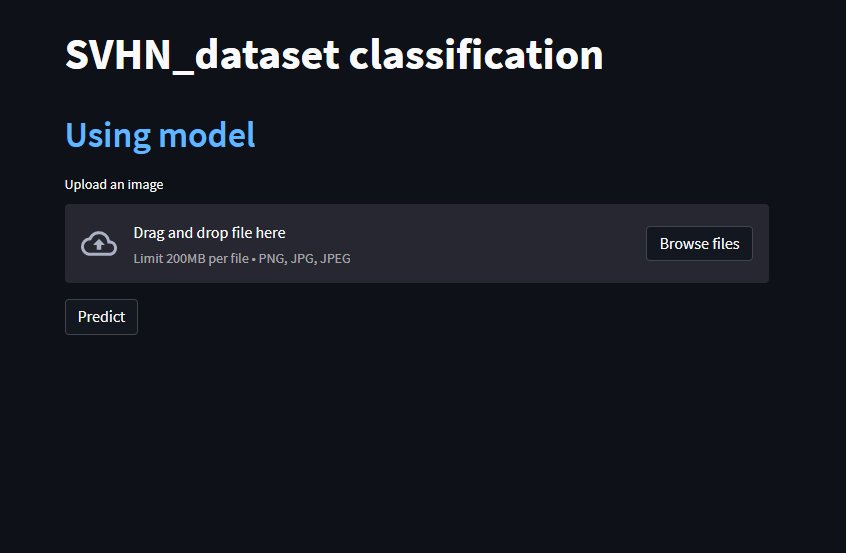

# SVHN_dataset
The [Street View House Numbers (SVHN) Dataset](https://www.tensorflow.org/datasets/catalog/svhn_cropped) is an image digit recognition dataset of over 600,000 digit images coming from real world data. Images are cropped to 32x32.


## Clone recursively
``` shell
git clone https://github.com/airiuz/SVHN_dataset.git
```
## Enter this file
``` shell
cd SHVN_dataset
```
## Install Virtual environment
To use the SHVN_dataset dataset, it is recommended to create a virtual environment in Python. You can do this by using the virtualenv package. First, install virtualenv using pip:
``` shell
python -m pip install --user virtualenv
```
## give a name this environment
``` shell
python -m venv your_env
```
## Activate this environment
``` shell
your_env\Scripts\activate.bat
```
## Install requirements
``` shell
pip install -r requirement.txt
```
## Open jupyter notebook
``` shell
jupyter notebook
```
## Run streamlit
``` shell
streamlit run streamlit.py
```


## Predict

